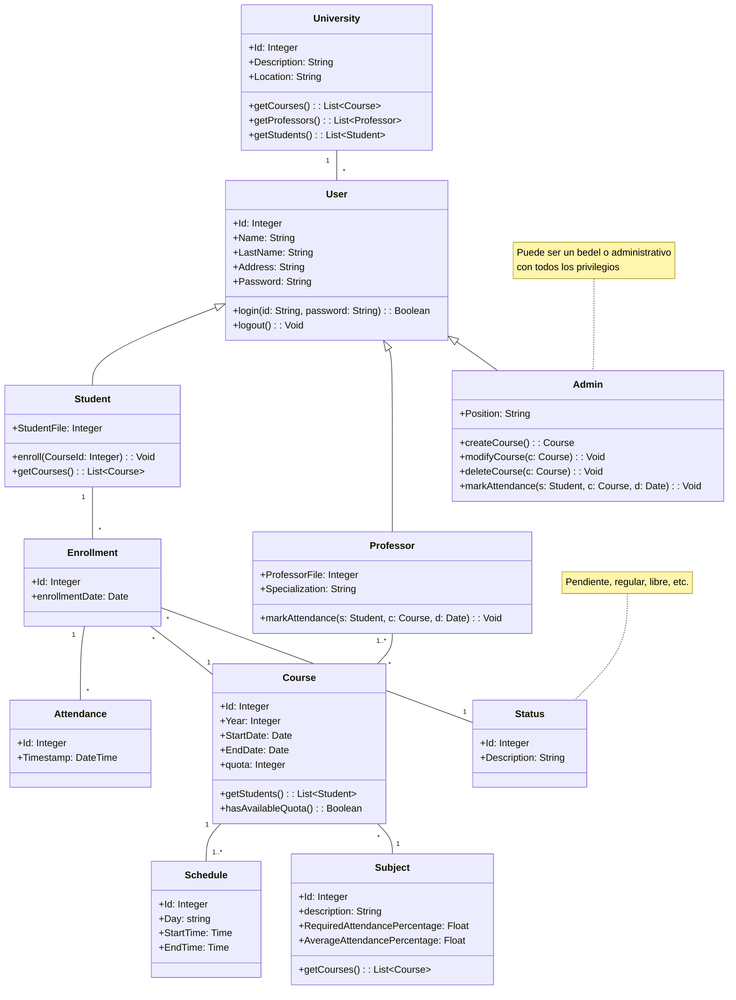

# Propuesta #1: Software de Seguimiento de Asistencias

## 1. Introducción

### 1.1 Objetivo
El objetivo de este proyecto es desarrollar un sistema de seguimiento de asistencias utilizando Visual Studio y tecnologías .NET. Este sistema permitirá a los usuarios con rol de `profesor` administrar y monitorear la asistencia de los `alumnos`, evaluar el rendimiento académico y gestionar otros aspectos clave de la vida universitaria. El propósito es simplificar el proceso de verificación del cumplimiento de los `alumnos` con las condiciones de regularidad y promoción en cada `asignatura`.

### 1.2 Alcance
El sistema incluirá funcionalidades para la autenticación de usuarios, gestión de roles y permisos, administración de asignaturas y asistencias, y generación de reportes.

## 2. Descripción del Sistema

### 2.1 Dominio del Sistema

<!-- Diagrama de Clases hecho con Mermaid -->

- **Consideraciones:**
  1. Para simplificar el modelo se han omitido algunos métodos.

- **Cuestiones a Resolver:**
  1. ¿Mantener las condiciones de regularidad y promoción en la clase "Asignatura" o crear una clase específica?
      - ¿Se añadirán más condiciones como calificaciones y promedios en el sistema?

### 2.2 Permisos de Usuarios
#### Admin
**Los administradores tienen los siguientes permisos dentro del sistema:**
- **Gestionar Cursos:** pueden acceder, crear, modificar y eliminar cursos dentro de la universidad.
    - Entre otras operaciones CRUD dado que posee todos los privilegios en dicha universidad.
- **Marcar Asistencia:** tienen la capacidad de registrar la asistencia de los alumnos en los cursos.
- **Consultar Información de Alumnos y Profesores:** pueden buscar y visualizar información básica de otros usuarios.
- **Generar Reportes de Asistencia:** tienen acceso para generar reportes de asistencia de los alumnos en los cursos.

#### Profesores
**Los profesores tienen los siguientes permisos dentro del sistema:**
- **Marcar Asistencia:** pueden registrar la asistencia de los alumnos **solo ** en los cursos que imparten.
- **Consultar Información de Alumnos:** pueden buscar y visualizar información básica de los alumnos inscriptos a los cursos que imparten.
- **Ver Información del Curso:** pueden visualizar detalles del curso, como horarios y condiciones de regularidad.
- **Consultar Reportes:** tienen la capacidad de generar reportes de asistencia y rendimiento académico de los alumnos inscritos en sus cursos.

### 2.3 Reglas de Negocio
#### 2.3.1 Determinación del Estado de un Alumno en un Curso
El estado del alumno con un curso (_cursado_) se calcula automáticamente de acuerdo a sus asistencias, y puede ser:
- **Pendiente:** aún no ha finalizado el curso ni superado el límite de inasistencias permitidas.
- **Regular:** cuando ha cumplido con las asistencias mínimas y otros requisitos académicos del curso.
- **Libre:** supera el límite de inasistencias permitidas.
    - Esto indica que no cumple con los requisitos para considerarse regular en el curso.

#### 2.3.2 Validación de Asistencia
Se debe validar que la asistencia del alumno coincida con los horarios de la asignatura en cuestión. Esto implica que si un alumno es marcado presente fuera de los horarios establecidos del curso, dicha asistencia no será considerada válida.

#### 2.3.3 Múltiples Horarios de Curso
Un mismo curso puede tener más de un horario, esto se debe a que puede tener más de un día de cursado semanal. Cada uno de estos horarios debe ser registrado y gestionado adecuadamente para reflejar la realidad del cronograma de clases.

#### 2.3.4 Rol de Profesor
El rol del profesor especifica si es de teoría, práctica, un auxiliar o cualquier otra descripción adicional que se considere necesaria.

## 3. Requerimientos Funcionales

### 3.1 Autenticación
- [ ] Implementar un sistema de login que controle el acceso de los usuarios existentes.

### 3.2 Autorización
- [ ] Incluir al menos dos tipos de usuarios: Alumnos y Profesores.
- [ ] Cada tipo de usuario tendrá acceso a diferentes funcionalidades.

### 3.3 Gestión de Entidades (ABMs)
- [ ] Implementar al menos 6 ABMs (Alta, Baja, Modificación) para diferentes entidades del sistema.
- [ ] Incluir una búsqueda con filtros en al menos uno de los ABMs.

### 3.4 Reportes
- [ ] Generar al menos 2 reportes (y opcionalmente un gráfico).

## 4. Requerimientos Técnicos

### 4.1 Plataforma
- [ ] El sistema debe funcionar tanto en Desktop como en Web.

### 4.2 Acceso a Datos
- [ ] Utilizar ADO.NET al menos una vez para el acceso a datos.
- [ ] Usar Entity Framework para el resto de las operaciones de acceso a datos.

### 4.3 Validaciones
- [ ] Implementar validaciones a nivel UI y a nivel Modelo de Dominio o Lógica de Negocios.

## 5. Diagramas Adicionales
...
