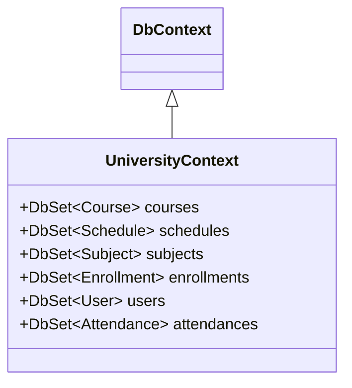
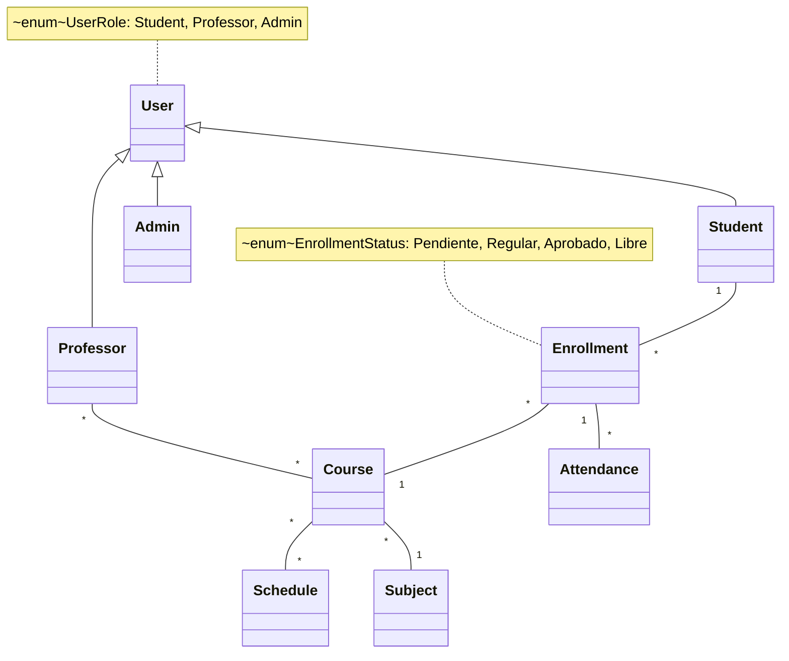

# Trabajo Práctico Integrador: Seguimiento de Asistencia Académica
- **Asignatura:** [Tecnologías de Desarrollo de Software IDE](https://github.com/NetUTNRosario/Labs)
- **Comisión:** 3EK01
- **Estado:** pendiente.

## 👥 Grupo N°3
### Integrantes
- `50671` - Gustavo Giampietro
- `47889` - Santiago Liveratore
-  `48042` - Marina Milo

## 📝 Descripción del Proyecto
Este proyecto es una aplicación de gestión de asistencia académica desarrollada en el contexto de la asignatura "Tecnologías de Desarrollo de Software IDE" de la Universidad Tecnológica Nacional FRRo. La aplicación permite gestionar usuarios, cursos, horarios y asistencias, utilizando tecnologías .NET.
- **Para más información consulte la Wiki [aquí](https://github.com/MVRU/TPI-NET/wiki).**
- **Para conocer acerca de la estructura de la solución haga clic [aquí](https://github.com/MVRU/TPI-NET/wiki/Estructura-de-la-Soluci%C3%B3n).**

## 📊 Diagrama de Clases
A continuación se muestra el diagrama de clases simplificado de la aplicación, que ilustra la estructura y relaciones entre las diferentes entidades del sistema.





## 📦 Instalación
1. Clonar el repositorio.
   ```bash
   git clone https://github.com/MVRU/TPI-NET
   ```
2. ...

## 🔗 Enlaces Útiles
- 📢 [Anuncios](https://github.com/MVRU/TPI-NET/discussions/categories/anuncios) - Actualizaciones importantes sobre el proyecto.
- ❓ [Q&A](https://github.com/MVRU/TPI-NET/discussions/categories/q-a) - Preguntas frecuentes sobre el proyecto.
- 💡 [Sugerencias](https://github.com/MVRU/TPI-NET/discussions/categories/ideas) - Lugar para enviar tus sugerencias y mejoras.
- 📋 [Kanban Project](https://github.com/users/MVRU/projects/4) - Kanban con las tareas del proyecto.
- 🏆 [Milestones](https://github.com/MVRU/TPI-NET/milestones) - Seguimiento de hitos del proyecto.

## 🤝 Contribuciones
Las contribuciones son bienvenidas. Si deseas colaborar, por favor abre un issue o envía un pull request.
