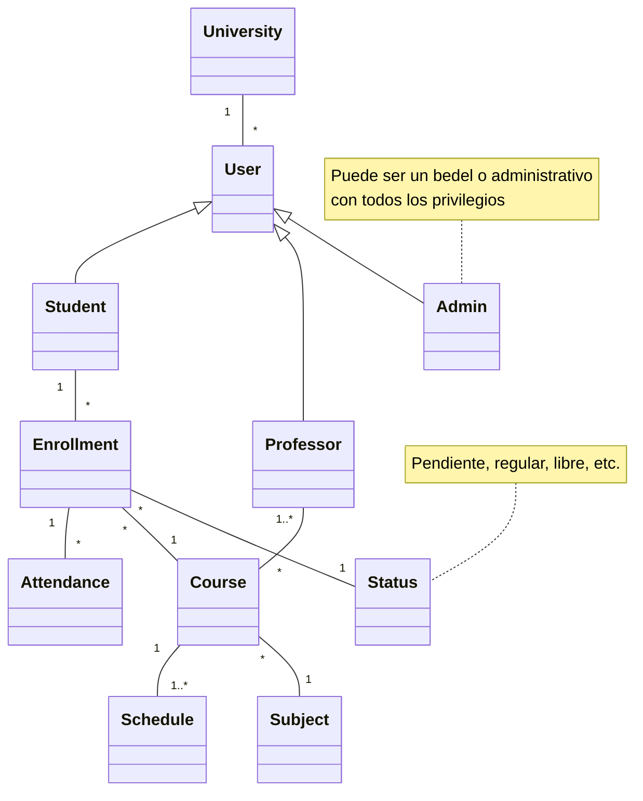

# Trabajo Práctico Integrador: Seguimiento de Asistencia Académica
- **Asignatura:** [Tecnologías de Desarrollo de Software IDE](https://github.com/NetUTNRosario/Labs)
- **Comisión:** 3EK01
- **Estado:** pendiente.

## 👥 Grupo N°3
### Integrantes
- `50671` - Gustavo Giampietro
- `47889` - Santiago Liveratore
-  `48042` - Marina Milo

## 📝 Descripción del Proyecto
Este proyecto es una aplicación de gestión de asistencia académica desarrollada en el contexto de la asignatura "Tecnologías de Desarrollo de Software IDE" de la Universidad Tecnológica Nacional FRRo. La aplicación permite gestionar usuarios, cursos, horarios y asistencias, utilizando tecnologías .NET.

## 🚀 Características
- **Gestión de Asistencia:** permite a los usuarios registrar y consultar la asistencia de los alumnos.
- **Reportes:** genera reportes visuales sobre la asistencia, facilitando el análisis de datos.

## ⚙️ Tecnologías Utilizadas
- **.NET Core:** plataforma de desarrollo para construir aplicaciones modernas y escalables.
- **C#:** lenguaje de programación utilizado para desarrollar la lógica del backend.
- **Entity Framework:** ORM utilizado para interactuar con la base de datos de manera sencilla.
  - **ADO .NET:** Utilizado para realizar consultas menores a la base de datos.
- **SQL Server:** sistema de gestión de bases de datos para almacenar la información de la aplicación.
- **Visual Studio:** entorno de desarrollo integrado (IDE) para desarrollar, depurar y ejecutar la aplicación.

## 📊 Diagrama de Clases
A continuación se muestra el diagrama de clases simplificado de la aplicación, que ilustra la estructura y relaciones entre las diferentes entidades del sistema.


Para obtener más detalles sobre el proyecto, visite la propuesta [aquí](https://github.com/MVRU/TPI-NET/tree/main/Proposal).

## 📦 Instalación
1. Clonar el repositorio.
   ```bash
   git clone https://github.com/MVRU/TPI-NET
   ```
3. ...

## 🔗 Enlaces Útiles
- 📢 [Anuncios](https://github.com/MVRU/TPI-NET/discussions/categories/anuncios) - Actualizaciones importantes sobre el proyecto.
- ❓ [Q&A](https://github.com/MVRU/TPI-NET/discussions/categories/q-a) - Preguntas frecuentes sobre el proyecto.
- 💡 [Sugerencias](https://github.com/MVRU/TPI-NET/discussions/categories/ideas) - Lugar para enviar tus sugerencias y mejoras.
- 📋 [Kanban Project](https://github.com/users/MVRU/projects/4) - Kanban con las tareas del proyecto.
- 🏆 [Milestones](https://github.com/MVRU/TPI-NET/milestones) - Seguimiento de hitos del proyecto.

## 🤝 Contribuciones
Las contribuciones son bienvenidas. Si deseas colaborar, por favor abre un issue o envía un pull request.
