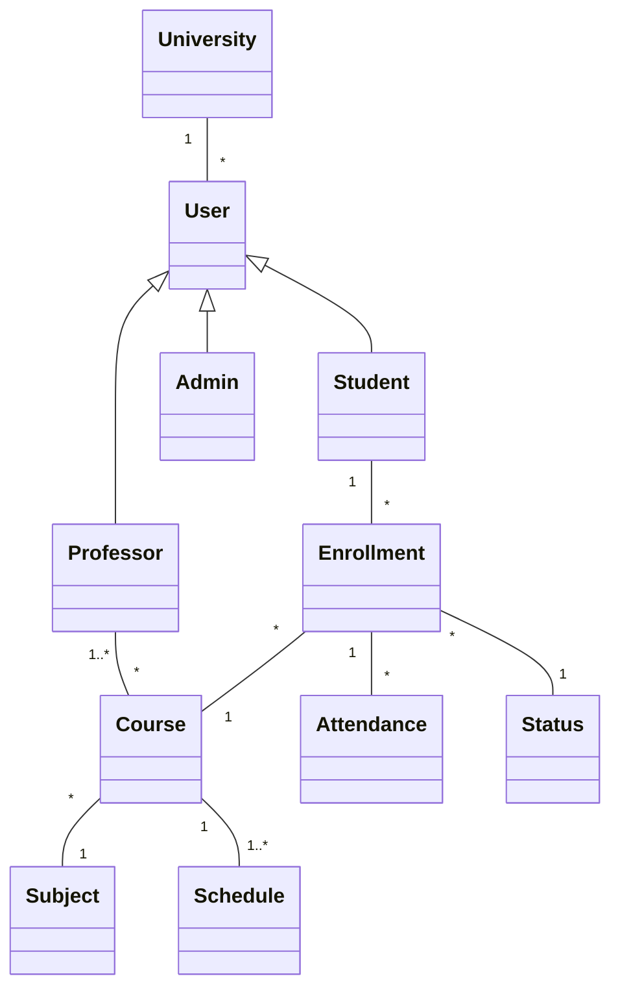

# Trabajo Práctico Integrador
- **Asignatura:** [Tecnologías de Desarrollo de Software IDE](https://github.com/NetUTNRosario/Labs).
- **Comisión:** 3EK01.
- **Estado:** En desarrollo.

## Grupo N°3
### Integrantes
- `50671` - Gustavo Giampietro
- `47889` - Santiago Liveratore
- `48042` - Marina Milo

## Descripción del Proyecto
El sistema de Seguimiento de Asistencias permite a profesores y administradores gestionar y monitorear la asistencia de alumnos, así como evaluar su rendimiento académico. Implementado con Visual Studio y tecnologías .NET, tiene como objetivo optimizar la verificación del cumplimiento de los estudiantes con las condiciones de regularidad y promoción en cada asignatura.

## Instalación
...

## Tecnologías Usadas
- .NET
- ASP.NET Core
- Entity Framework
- ADO.NET
- SQL Server

## Contribuciones
Se invita a aquellos interesados en contribuir a seguir los siguientes pasos:
1. Realizar un fork del repositorio.
2. Crear una nueva rama con el siguiente comando: `git checkout -b feature/nueva-caracteristica`
3. Realizar los cambios y hacer commit con el siguiente comando: `git commit -m "Descripción del cambio"`
4. Enviar un pull request para su revisión.

## Capturas de Pantalla
...

## Diagrama de Clases Simplificado

```mermaid
classDiagram
    University "1" -- "*" User
    User <|-- Student
    User <|-- Professor
    User <|-- Admin
    Professor "1..*" -- "*" Course
    Enrollment "1" -- "*" Attendance
    Student "1" -- "*" Enrollment
    Enrollment "*" -- "1" Course
    Course "*" -- "1" Subject
    Enrollment "*" -- "1" Status
    Course "1" -- "1..*" Schedule
```

## Documentación
Para revisar documentación más detallada sobre el proyecto, se recomienda consultar los archivos ubicados en el directorio [`TPI-NET/docs`](https://github.com/MVRU/TPI-NET/tree/main/docs).
