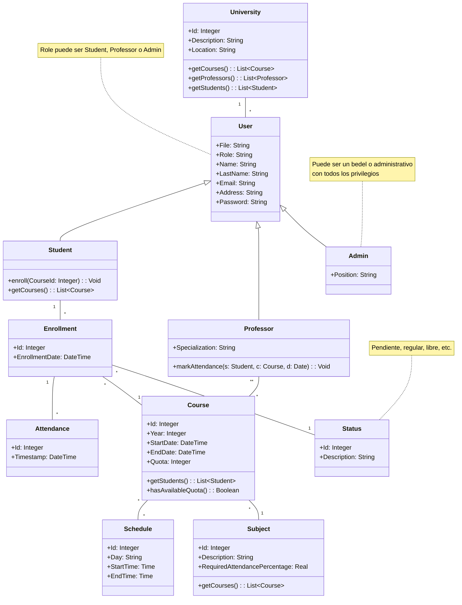

# Propuesta #1: Software de Seguimiento de Asistencias

## 1. Introducción

### 1.1 Objetivo
El objetivo del proyecto es desarrollar un sistema de seguimiento de asistencias en Visual Studio con tecnologías .NET, permitiendo a los usuarios con rol de `Professor` administrar y monitorear la asistencia de los `Student`, evaluar el rendimiento académico y gestionar otros aspectos clave de la vida universitaria. Este sistema facilitará la verificación del cumplimiento de las condiciones de regularidad y promoción de cada `Subject`.

### 1.2 Alcance
El sistema incluye autenticación de usuarios, gestión de roles y permisos, administración de asignaturas y asistencias, y generación de reportes.

## 2. Descripción del Sistema

### 2.1 Dominio del Sistema

<!-- Diagrama de Clases hecho con Mermaid -->

- **Consideraciones del Modelo:**
  1. Se omiten métoddos como `create`, `update`, `delete`, `login` y `signin` por considerarse implícitos.
  2. Se omiten tablas intermedias como `CourseSchedule` y `CourseUser`.
  3. Un horario `Schedule` puede asignarse a varios cursos `Courses`, lo que reduce redundancia y facilita la reutilización de horarios comunes al crear cursos.

- **Cuestiones a Resolver:**
  1. ¿Mantener las condiciones de regularidad y promoción en `Subject` o crear una clase específica?
      - ¿Se incluirán condiciones adicionales como calificaciones y promedios?

### 2.2 Permisos de Usuarios
#### Admin
**Los administradores tienen los siguientes permisos:**
- **Gestionar Cursos:** acceso total para crear, modificar y eliminar cursos.
- **Marcar Asistencia:** capacidad para registrar la asistencia de alumnos.
- **Consultar Información de Usuarios:** visualización de información básica de alumnos, profesores y otros administradores.
- **Generar Reportes:** acceso a reportes, como asistencias por curso.

#### Profesores
**Los profesores tienen los siguientes permisos:**
- **Marcar Asistencia:** registrar la asistencia de alumnos **solo** en los cursos que imparten.
- **Consultar Información de Alumnos:** visualizar información básica de alumnos inscritos en sus cursos.
- **Ver Información del Curso:** acceder a detalles de horarios y condiciones de regularidad de cursos que imparten.
- **Consultar Reportes:** generar reportes de asistencia y rendimiento de alumnos en sus cursos.

### 2.3 Reglas de Negocio
#### 2.3.1 Determinación del Estado de un Alumno en un Curso
El `Status` del alumno con un curso (`Enrollment`) se calcula automáticamente según la asistencia:
- **Pendiente:** curso en progreso o sin comenzar, sin exceder el límite de inasistencias.
- **Regular:** cumple con la asistencia mínima y otros requisitos del curso.
- **Libre:** excede el límite de inasistencias o abandona el curso.
    - Este estado es utilizado también como "baja lógica" si se elimina el `Enrollment`.

#### 2.3.2 Validación de Asistencia
La asistencia debe coincidir con los horarios del curso. La asistencia fuera de los horarios establecidos no es válida.

#### 2.3.3 Múltiples Horarios de Curso
Cada curso puede tener varios horarios en diferentes días, los cuales deben gestionarse para reflejar el cronograma de clases.
- Esto considerando que un curso puede ser impartido por más de un profesor.

#### 2.3.4 Rol de Profesor
El atributo `Specialization` del profesor especifica si es de teoría, práctica, un auxiliar u otra descripción adicional relevante.

## 3. Requerimientos Funcionales

### 3.1 Autenticación
- [x] Implementar sistema de login para controlar el acceso de usuarios.

### 3.2 Autorización
- [x] Incluir al menos dos tipos de usuarios: Alumnos y Profesores.
- [ ] Asignar funcionalidades específicas a cada tipo de usuario.

### 3.3 Gestión de Entidades (ABMs)
- [ ] Implementar ABMs (Alta, Baja, Modificación) para al menos 6 entidades.
- [ ] Incluir filtros de búsqueda en al menos uno de los ABMs.

### 3.4 Reportes
- [ ] Generar al menos 2 reportes (con opción a gráficos).

## 4. Requerimientos Técnicos

### 4.1 Plataforma
- [x] Compatible con aplicaciones de escritorio.

### 4.2 Acceso a Datos
- [ ] Usar ADO.NET en al menos una operación de acceso a datos.
- [x] Implementar Entity Framework para el resto de las operaciones de datos.

### 4.3 Validaciones
- [ ] Incluir validaciones en la UI y en el modelo de dominio o lógica de negocio.

## 5. Diagramas Adicionales
...
