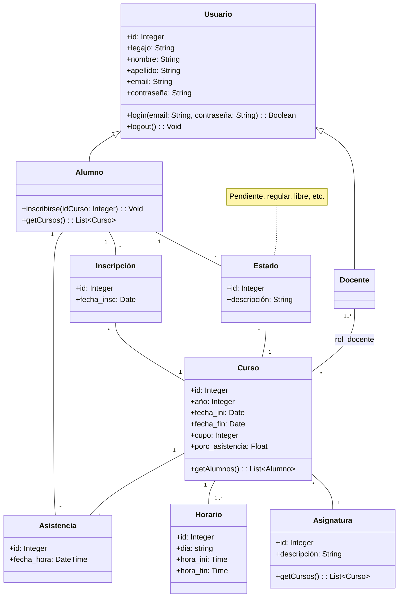

# Propuesta #1: Software de Seguimiento de Asistencias

## 1. Introducción

### 1.1 Objetivo
El objetivo de este proyecto es desarrollar un sistema de seguimiento de asistencias utilizando Visual Studio y tecnologías .NET. Este sistema permitirá a los usuarios con rol de `profesor` administrar y monitorear la asistencia de los `alumnos`, evaluar el rendimiento académico y gestionar otros aspectos clave de la vida universitaria. La finalidad es facilitar la determinación de si los `alumnos` cumplen con las condiciones de regularidad y promoción de la `asignatura`.

### 1.2 Alcance
El sistema incluirá funcionalidades para la autenticación de usuarios, gestión de roles y permisos, administración de asignaturas y asistencias, y generación de reportes.

## 2. Descripción del Sistema

### 2.1 Dominio del Sistema

<!-- Diagrama de Clases hecho con Mermaid -->

- **Consideraciones:**
  1. Se debe validar que la asistencia del alumno coincida con los horarios de la asignatura en cuestión.
  2. Un mismo curso puede tener más de un horario, pues puede tener más de un día de cursado semanal.
  3. El rol del docente especifica si es de teoría, práctica o cualquier descripción adicional.
  4. El estado del alumno con un curso se calcula automáticamente de acuerdo a sus asistencias.
      - **Pendiente:** el curso aún no terminó y no superó las inasistencias permitidas.
      - **Regular:** el curso acabó y el alumno cumplió con las asistencias requeridas.
      - **Libre:** el alumno superó las inasistencias permitidas.

### 2.2 Modelo de Datos
...

## 3. Requerimientos Funcionales

### 3.1 Autenticación
- [ ] Implementar un sistema de login que controle el acceso de los usuarios existentes.

### 3.2 Autorización
- [ ] Incluir al menos dos tipos de usuarios: Alumnos y Docentes.
- [ ] Cada tipo de usuario tendrá acceso a diferentes funcionalidades.

### 3.3 Gestión de Entidades (ABMs)
- [ ] Implementar al menos 6 ABMs (Alta, Baja, Modificación) para diferentes entidades del sistema.
- [ ] Incluir una búsqueda con filtros en al menos uno de los ABMs.

### 3.4 Reportes
- [ ] Generar al menos 2 reportes, uno de los cuales debe incluir un gráfico.

## 4. Requerimientos Técnicos

### 4.1 Plataforma
- [ ] El sistema debe funcionar tanto en Desktop (o Mobile) como en Web.

### 4.2 Acceso a Datos
- [ ] Utilizar ADO.NET al menos una vez para el acceso a datos.
- [ ] Usar Entity Framework para el resto de las operaciones de acceso a datos.

### 4.3 Validaciones
- [ ] Implementar validaciones a nivel UI y a nivel Modelo de Dominio o Lógica de Negocios.

## 5. Diagramas Adicionales
...
